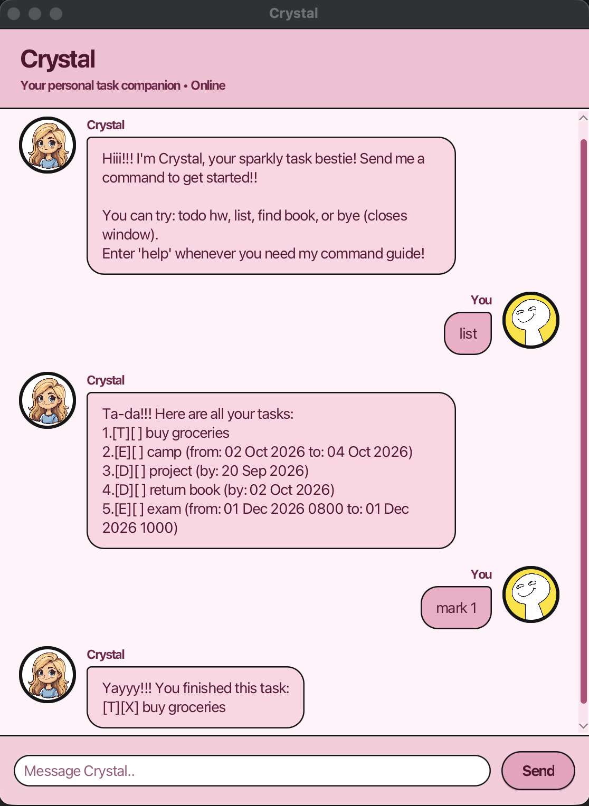

# Crystal User Guide

**Crystal** is a friendly desktop chatbot that helps you keep track of todos,
deadlines, events, and tasks that can be completed within a period.



## Quick start

1. Ensure that Java 25 is installed on your computer.
2. Download the latest `crystal.jar` from the project's
   [Releases page](https://github.com/chesterlim2004/ip/releases).
3. Place the JAR file in the folder where you want Crystal to keep its data.
4. Open a terminal in that folder and run:

   ```bash
   java -jar crystal.jar
   ```

5. Enter a command in the message box, then press **Enter** or click **Send**.
   Try `todo buy groceries` to add your first task.

Crystal saves your tasks automatically in `data/crystal.txt`. If the file does
not exist yet, Crystal creates it when you make your first change.

## Command format

- Replace words in `UPPER_CASE` with your own details.
- Use the task numbers shown by `list` for `mark`, `unmark`, and `delete`.
- Commands are lowercase and should not have spaces at the start or end.
- Dates and times are optional unless the command format requires them.

## Features

### Add a todo: `todo`

Adds a task without a date or time.

Format: `todo DESCRIPTION`

Example: `todo buy groceries`

### Add a deadline: `deadline`

Adds a task that must be completed by a specified date, time, or phrase.

Format: `deadline DESCRIPTION /by DEADLINE`

Example: `deadline submit report /by 20 Sep 2026 6pm`

### Add an event: `event`

Adds an activity with a start and end.

Format: `event DESCRIPTION /from START /to END`

Example: `event project meeting /from Monday 2pm /to 4pm`

### Add a within-period task: `within`

Adds a task that can be completed during a period. When both values are dates,
the start and end dates are included in that period.

Format: `within DESCRIPTION /from START /to END`

Example: `within revise chapter 3 /from 20 Sep 2026 /to 25 Sep 2026`

### View all tasks: `list`

Shows every task and its task number.

Format: `list`

### View tasks on a date: `list /on`

Shows dated tasks that occur on the specified date. Todos and tasks with only
free-form scheduling text are not included.

Format: `list /on DATE`

Example: `list /on 20 Sep 2026`

### Find tasks: `find`

Finds tasks whose descriptions contain the keyword. Matching is
case-insensitive.

Format: `find KEYWORD`

Example: `find report`

### Mark a task as done: `mark`

Marks the numbered task as completed.

Format: `mark TASK_NUMBER`

Example: `mark 2`

### Mark a task as not done: `unmark`

Marks the numbered task as incomplete again.

Format: `unmark TASK_NUMBER`

Example: `unmark 2`

### Delete a task: `delete`

Permanently removes the numbered task.

Format: `delete TASK_NUMBER`

Example: `delete 2`

### View help: `help`

Shows Crystal's command guide.

Format: `help`

### Exit Crystal: `bye`

Shows Crystal's farewell and closes the application.

Format: `bye`

## Dates and times

Crystal understands common date formats such as `2026-09-20`, `20/9/2026`,
`20/9/26`, and `20 Sep 2026`. It understands times such as `6pm`, `6.30pm`,
`18:30`, and `1830`. Recognized values are displayed in a consistent format.

You may also use meaningful text such as `Monday` or `after class` when adding
a deadline, event, or within-period task. Crystal keeps unrecognized date text
exactly as task information, but `list /on DATE` can only match calendar dates.

## Command summary

| Action | Command |
| --- | --- |
| Add a todo | `todo DESCRIPTION` |
| Add a deadline | `deadline DESCRIPTION /by DEADLINE` |
| Add an event | `event DESCRIPTION /from START /to END` |
| Add a within-period task | `within DESCRIPTION /from START /to END` |
| View all tasks | `list` |
| View tasks on a date | `list /on DATE` |
| Find tasks | `find KEYWORD` |
| Mark a task as done | `mark TASK_NUMBER` |
| Mark a task as not done | `unmark TASK_NUMBER` |
| Delete a task | `delete TASK_NUMBER` |
| View help | `help` |
| Exit Crystal | `bye` |
